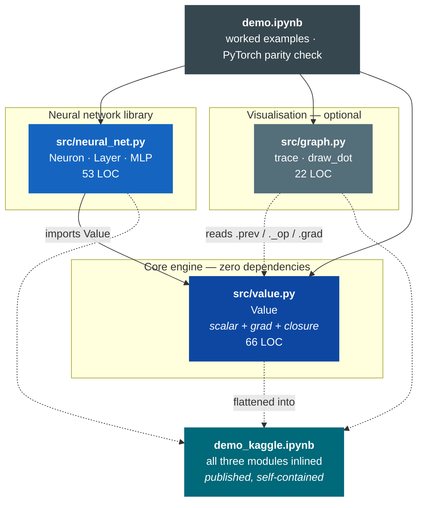
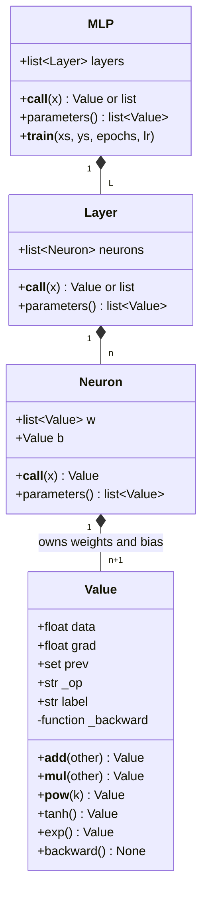
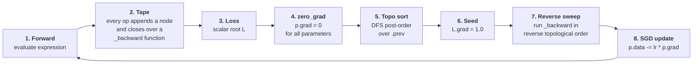
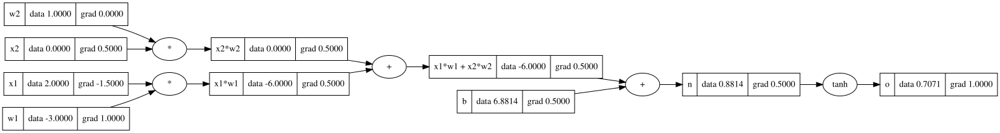
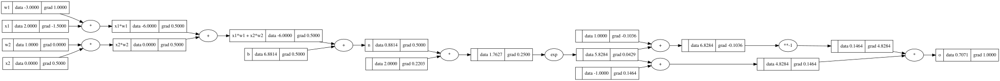
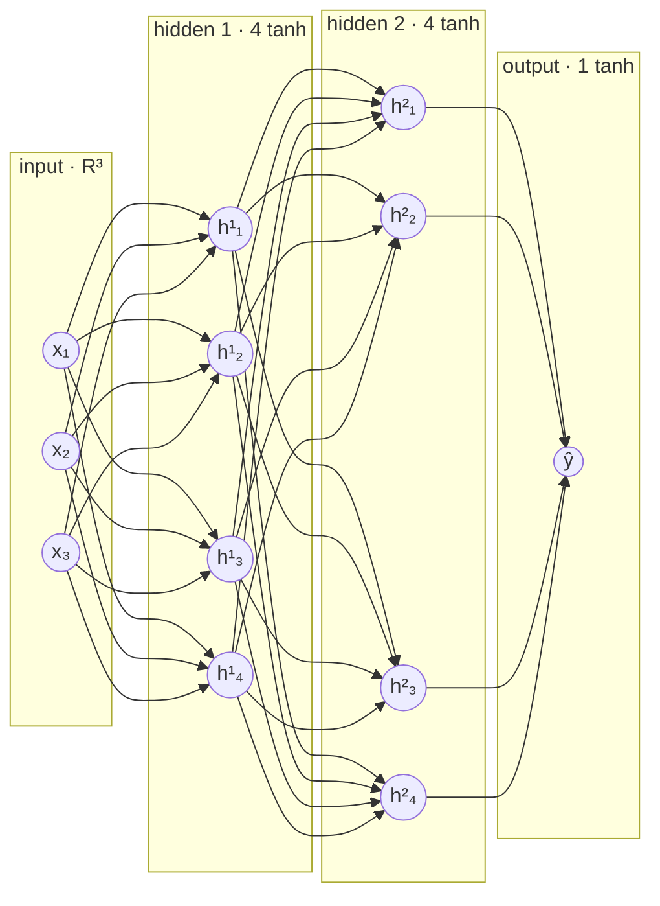

<div align="center">

# micrograd-clone

**A scalar-valued reverse-mode automatic differentiation engine, and a neural network library built on top of it — in 141 lines of dependency-free Python.**

[](https://www.python.org/)
[](#tech-stack)
[](src/value.py)
[](#numerical-verification)
[](#cross-validation-against-pytorch)
[](https://www.kaggle.com/code/muratkolic/backpropagation-from-scratch)

</div>

---

## Table of contents

- [What this is](#what-this-is)
- [Quick start](#quick-start)
- [Architecture](#architecture)
- [The mathematics of reverse-mode AD](#the-mathematics-of-reverse-mode-ad)
  - [Why reverse mode](#why-reverse-mode)
  - [The tape: a DAG built by operator overloading](#the-tape-a-dag-built-by-operator-overloading)
  - [Local derivatives: the full operator table](#local-derivatives-the-full-operator-table)
  - [Why gradients accumulate](#why-gradients-accumulate)
  - [Why topological order is required](#why-topological-order-is-required)
- [A fully worked example](#a-fully-worked-example)
- [The neural network library](#the-neural-network-library)
- [Verification](#verification)
- [Performance characteristics](#performance-characteristics)
- [API reference](#api-reference)
- [Tech stack](#tech-stack)
- [Repository layout](#repository-layout)
- [Known limitations](#known-limitations)
- [Roadmap](#roadmap)
- [References](#references)

---

## What this is

Every modern deep learning framework — PyTorch, JAX, TensorFlow — is, at its core, two things: a **tape** that records the operations you perform, and a **reverse sweep** that walks that tape backwards applying the chain rule. Everything else (tensors, kernels, fusion, device placement, distributed training) is performance engineering layered on top of that idea.

This repository strips the idea back to its irreducible form. `Value` is a scalar that remembers where it came from. Composing `Value`s with ordinary Python operators (`+`, `*`, `**`, `/`) builds a directed acyclic graph as a side effect. Calling `.backward()` on any node computes the exact partial derivative of that node with respect to every leaf that fed into it — in a single pass, at the same asymptotic cost as the forward computation.

On top of that engine sits a small neural network library (`Neuron` → `Layer` → `MLP`) with a PyTorch-shaped API, plus a Graphviz renderer that draws the computational graph with data and gradient annotations on every node.

**This is a reimplementation of [Andrej Karpathy's `micrograd`](https://github.com/karpathy/micrograd), written from first principles as a study of autodiff internals.** It is intentionally not a production framework — see [Known limitations](#known-limitations) for an honest accounting.

> **Scope in one line:** 5 differentiable primitives, 3 derived operators, one topological sort, and a 41-parameter MLP that drives a 4-point binary classification task to a loss of `2.3e-3` in 200 full-batch steps.

---

## Quick start

**Zero setup:** the whole project — engine, NN library, renderer, worked examples — is also published as a single self-contained notebook on Kaggle, runnable in the browser with nothing installed:

<a href="https://www.kaggle.com/code/muratkolic/backpropagation-from-scratch" target="_blank"></a>

**Locally:**

```bash
git clone https://github.com/muuki2/micrograd-clone.git
cd micrograd-clone
```

The engine itself has **no dependencies** — `src/value.py` imports only `math` from the standard library. To run the demo notebook and render graphs you need a few extras:

```bash
python -m venv .venv && source .venv/bin/activate
pip install graphviz jupyter numpy matplotlib torch   # torch is used only to cross-check gradients
brew install graphviz                                 # the `dot` binary; apt-get install graphviz on Linux
```

### 30-second example

```python
from src.value import Value

a = Value(2.0, label='a')
b = Value(-3.0, label='b')
c = Value(10.0, label='c')

d = a * b + c          # d = -6 + 10 = 4
e = (d * 2).tanh()     # squash it
e.backward()           # reverse sweep

print(a.grad)          # dE/da = -3 * 2 * (1 - tanh(8)^2)
print(b.grad)          # dE/db =  2 * 2 * (1 - tanh(8)^2)
```

### Training an MLP

```python
import random
from src.neural_net import MLP

random.seed(1337)                  # weights are U(-1,1); seed for reproducibility
model = MLP(3, [4, 4, 1])          # 3 inputs -> 4 -> 4 -> 1 output; 41 parameters

xs = [[2.0, 3.0, -1.0],
      [3.0, -1.0, 0.5],
      [0.5, 1.0,  1.0],
      [1.0, 1.0, -1.0]]
ys = [1.0, -1.0, -1.0, 1.0]        # targets in tanh's range

model.__train__(xs, ys, epochs=50, learning_rate=0.05)
# 0   6.005402783252284
# ...
# 49  0.012490491084925733

print([round(model(x).data, 3) for x in xs])
# -> [0.937, -0.988, -0.938, 0.936]      all four signs correct
```

> **Note on the method name.** The training loop in `src/neural_net.py` is currently named `__train__`, not `train`. Both `demo.ipynb` and the published Kaggle notebook call `n.train(...)`, so `demo.ipynb` raises `AttributeError` against the current `src/`. This is [limitation 1](#known-limitations) and a one-word fix.

### Visualising a graph

```python
from src.graph import draw_dot
draw_dot(e)            # returns a graphviz.Digraph; renders inline in Jupyter
```

---

## Architecture

Three modules, one direction of dependency, no cycles.



### Object model



### Execution lifecycle

A single training step traverses the graph exactly twice — once forward to build it, once backward to differentiate it.



Step 4 is not optional. Gradients accumulate by design (see [Why gradients accumulate](#why-gradients-accumulate)), so skipping the reset silently sums gradients across epochs and corrupts training.

---

## The mathematics of reverse-mode AD

### Why reverse mode

Consider a differentiable function $f : \mathbb{R}^n \to \mathbb{R}^m$ expressed as a composition of elementary operations. There are two ways to propagate derivatives through that composition.

**Forward mode** propagates directional derivatives from inputs to outputs. It computes one column of the Jacobian per sweep — a Jacobian-vector product $J v$ — so recovering the full Jacobian costs $n$ sweeps.

**Reverse mode** propagates sensitivities from outputs back to inputs. It computes one row of the Jacobian per sweep — a vector-Jacobian product $v^\top J$ — so the full Jacobian costs $m$ sweeps.

$$
\text{cost}_{\text{forward}} \sim n \cdot \text{cost}(f)
\qquad\qquad
\text{cost}_{\text{reverse}} \sim m \cdot \text{cost}(f)
$$

Neural network training is the extreme case of $n \gg m$: the input is every parameter in the model (here $n = 41$; in a frontier model, $n \sim 10^{12}$) and the output is a single scalar loss, $m = 1$. Reverse mode computes the **entire** gradient in one sweep. Forward mode would need one sweep per parameter.

This is the *cheap gradient principle*, formalised by the Baur–Strassen theorem: for a function built from arithmetic operations, the gradient can be evaluated at a cost bounded by a small constant multiple of evaluating the function itself — typically cited as $\le 4$–$5\times$ — **independent of $n$**. It is the single result that makes deep learning computationally feasible.

### The tape: a DAG built by operator overloading

Every `Value` is a node. Every arithmetic operation constructs a new node that holds a reference to its operands:

```python
def __mul__(self, other):
    other = other if isinstance(other, Value) else Value(other)
    out = Value(self.data * other.data, (self, other), '*')   # <-- edges recorded here
    def _backward():
        self.grad  += other.data * out.grad                   # <-- closure over self, other, out
        other.grad += self.data  * out.grad
    out._backward = _backward
    return out
```

Three things happen in those five lines, and together they are the whole engine:

| Line | Mechanism | Purpose |
|---|---|---|
| `Value(self.data * other.data, ...)` | forward evaluation | compute the primal value |
| `(self, other)` passed as `_children` | edge recording | build the DAG structure |
| `out._backward = _backward` | closure capture | store the local VJP, with operands and output already bound |

The closure is the elegant part. `_backward` captures `self`, `other`, and `out` by reference at graph-construction time, so at backward time it needs no arguments and no external bookkeeping — it already knows everything about its own local derivative. The "tape" is not a separate data structure; it *is* the graph of closures.

The graph is a **DAG**, not a tree: a `Value` used twice appears once as a node with two outgoing edges. This is why `x + x` correctly yields $\partial/\partial x = 2$ rather than $1$.

### Local derivatives: the full operator table

The engine defines **five primitives** — operations that carry their own `_backward` closure — and derives everything else from them. That minimal set is a deliberate design choice: fewer primitives means fewer places for a derivative to be wrong.

Given $L$ as the scalar root of the graph and $u = g(\dots)$ an intermediate node, each primitive implements

$$
\frac{\partial L}{\partial(\text{input})} \mathrel{+}= \frac{\partial u}{\partial(\text{input})} \cdot \frac{\partial L}{\partial u}
$$

where $\partial L / \partial u$ is `out.grad` (the *upstream* gradient) and $\partial u / \partial(\text{input})$ is the **local** derivative.

#### Primitives

| Op | Forward | Local derivative | Implementation | Source |
|---|---|---|---|---|
| `__add__` | $u = a + b$ | $\dfrac{\partial u}{\partial a} = 1,\;\; \dfrac{\partial u}{\partial b} = 1$ | `a.grad += out.grad`<br/>`b.grad += out.grad` | [`value.py:16`](src/value.py#L16) |
| `__mul__` | $u = ab$ | $\dfrac{\partial u}{\partial a} = b,\;\; \dfrac{\partial u}{\partial b} = a$ | `a.grad += b.data * out.grad`<br/>`b.grad += a.data * out.grad` | [`value.py:32`](src/value.py#L32) |
| `__pow__` | $u = a^k$, $k$ const | $\dfrac{\partial u}{\partial a} = k\,a^{k-1}$ | `a.grad += k * a.data**(k-1) * out.grad` | [`value.py:44`](src/value.py#L44) |
| `tanh` | $u = \tanh(a)$ | $\dfrac{\partial u}{\partial a} = 1 - \tanh^2(a) = 1 - u^2$ | `a.grad += (1 - out.data**2) * out.grad` | [`value.py:56`](src/value.py#L56) |
| `exp` | $u = e^{a}$ | $\dfrac{\partial u}{\partial a} = e^{a} = u$ | `a.grad += out.data * out.grad` | [`value.py:63`](src/value.py#L63) |

Note the last two: both `tanh` and `exp` express their derivative in terms of **`out.data`**, the already-computed forward value. This is not a shortcut, it is the identity $\tanh'(x) = 1 - \tanh^2(x)$ and $\frac{d}{dx}e^x = e^x$ exploited to avoid recomputing a transcendental function during the backward pass. Production frameworks do exactly the same — it is the reason activations are cached in memory during training.

#### Derived operators

These carry no `_backward` of their own. They rewrite themselves into primitives, and the chain rule flows through the rewrite automatically:

| Op | Rewritten as | Why it is correct |
|---|---|---|
| `__neg__` | $-a \equiv a \cdot (-1)$ | falls through to `__mul__` |
| `__sub__` | $a - b \equiv a + (-b)$ | `__neg__` then `__add__` |
| `__truediv__` | $a / b \equiv a \cdot b^{-1}$ | `__pow__(-1)` then `__mul__` |

Division is worth checking by hand. With $u = a \cdot b^{-1}$:

$$
\frac{\partial u}{\partial b}
= a \cdot \frac{\partial}{\partial b}\!\left(b^{-1}\right)
= a \cdot \left(-1 \cdot b^{-2}\right)
= -\frac{a}{b^{2}}
$$

which is the quotient rule, recovered for free from `__pow__` and `__mul__` without ever being written down.

#### Derivation of the tanh gradient

$$
\tanh(x) = \frac{e^{2x} - 1}{e^{2x} + 1}
$$

Differentiating with the quotient rule, and writing $E = e^{2x}$ so that $E' = 2E$:

$$
\begin{aligned}
\tanh'(x) &= \frac{2E\,(E+1) - (E-1)\,2E}{(E+1)^2} \\[6pt]
&= \frac{2E\big[(E+1)-(E-1)\big]}{(E+1)^2}
= \frac{4E}{(E+1)^2}
\end{aligned}
$$

And independently,

$$
1 - \tanh^2(x) = \frac{(E+1)^2 - (E-1)^2}{(E+1)^2} = \frac{4E}{(E+1)^2}
$$

The two agree, so $\tanh'(x) = 1 - \tanh^2(x)$. `demo.ipynb` exercises this identity operationally: it builds the same neuron twice — once with `tanh` as an atomic primitive, once decomposed into `exp`, `+`, `-` and `/` — and renders both graphs. Comparing the leaf gradients across the two shows they agree to within **1 ULP** (max absolute difference $4.4\times10^{-16}$) despite the graphs having completely different shape. See [Structural verification](#structural-verification) for the numbers.

### Why gradients accumulate

This is the detail that most hand-rolled autodiff implementations get wrong, and the reason every `_backward` uses `+=` rather than `=`.

Suppose a node $v$ feeds into several downstream consumers $u_1, \dots, u_k$. The multivariate chain rule says the total sensitivity of $L$ to $v$ is the **sum** of the sensitivities along every path:

$$
\frac{\partial L}{\partial v} \;=\; \sum_{j=1}^{k} \frac{\partial L}{\partial u_j} \cdot \frac{\partial u_j}{\partial v}
$$

Each consumer $u_j$ runs its own `_backward` and contributes exactly one term of that sum. Using `=` would let the last consumer to execute overwrite every prior contribution — a bug that stays invisible on tree-shaped graphs and silently produces wrong gradients the moment a value is reused. Concretely:

```python
a = Value(2.0)
c = a + a          # a has fan-out 2
c.backward()
assert a.grad == 2.0   # 1 (from the left operand) + 1 (from the right); with `=` you would get 1.0
```

Weight sharing, residual connections, and multi-head attention are all just fan-out. `+=` is what makes them differentiate correctly.

The direct consequence: **gradients must be explicitly zeroed between optimisation steps.** `MLP.__train__` does this before every backward pass ([`neural_net.py:57`](src/neural_net.py#L57)) — and does it in the correct order, *before* `loss.backward()`, never after.

### Why topological order is required

`_backward` for node $v$ reads `v.grad` and pushes into its children. For that read to be valid, **every** consumer of $v$ must already have contributed its term to the sum above. Running the sweep in an arbitrary order would read a partially-accumulated gradient and propagate it downstream.

A reverse topological ordering of the DAG guarantees the required precondition: if there is an edge $v \to u$ (meaning $u$ consumes $v$), then $u$ is processed strictly before $v$.

```python
def backward(self):
    topo, visited = [], set()
    def build_topo(v):
        if v not in visited:
            visited.add(v)
            for child in v.prev:
                build_topo(child)
            topo.append(v)          # post-order: children appended before parents
    build_topo(self)
    self.grad = 1.0                 # seed: dL/dL = 1
    for node in reversed(topo):     # parents before children
        node._backward()
```

DFS post-order appends a node only after all of its children, producing an ordering in which inputs precede outputs. Reversing it puts outputs first — exactly the order the reverse sweep needs. The `visited` set makes this $O(N + E)$ and ensures each node's `_backward` fires exactly once, no matter how many paths reach it.

The seed `self.grad = 1.0` is the base case of the recursion: $\partial L/\partial L = 1$. Every other gradient in the graph is derived from it.

---

## A fully worked example

The canonical test case: a single neuron with two inputs, $\tanh$ activation, with the bias chosen so the output lands exactly on $\tfrac{\sqrt2}{2}$ and the arithmetic stays legible.

$$
x_1 = 2,\quad w_1 = -3,\quad x_2 = 0,\quad w_2 = 1,\quad b = 6.8813735870195432
$$

$$
n = x_1 w_1 + x_2 w_2 + b, \qquad o = \tanh(n)
$$

### Forward pass

| Node | Expression | Value |
|---|---|---|
| `x1*w1` | $2 \times (-3)$ | $-6.0$ |
| `x2*w2` | $0 \times 1$ | $0.0$ |
| `x1*w1 + x2*w2` | $-6 + 0$ | $-6.0$ |
| `n` | $-6 + 6.8813735870195432$ | $0.8813735870195432$ |
| `o` | $\tanh(0.88137\ldots)$ | $0.7071067811865476 = \tfrac{\sqrt2}{2}$ |

### Backward pass

Seed the root, then apply each local rule in reverse topological order.

**1 — Seed.** $\dfrac{\partial o}{\partial o} = 1$, so `o.grad = 1.0`.

**2 — Through `tanh`.** The local derivative is $1 - o^2$. The bias was chosen so that $o = \tfrac{\sqrt2}{2}$, hence $o^2 = \tfrac12$ analytically:

$$
\frac{\partial o}{\partial n} = 1 - o^2 = 1 - 0.5 = 0.5
\quad\Longrightarrow\quad
\texttt{n.grad} = 0.5 \times 1.0 = 0.5
$$

**3 — Through the additions.** Addition has local derivative $1$ with respect to both operands, so it acts as a pure **gradient router** — it copies the upstream gradient unchanged to every input:

$$
\texttt{b.grad} = 0.5,
\qquad
\texttt{(x1*w1 + x2*w2).grad} = 0.5
\quad\Longrightarrow\quad
\texttt{x1w1.grad} = \texttt{x2w2.grad} = 0.5
$$

**4 — Through the multiplications.** Multiplication is a **gradient swapper** — each operand receives the *other* operand's value times the upstream gradient:

$$
\begin{aligned}
\texttt{x1.grad} &= w_1 \cdot 0.5 = -3.0 \times 0.5 = -1.5 \\
\texttt{w1.grad} &= x_1 \cdot 0.5 = \;\;\,2.0 \times 0.5 = \;\;\,1.0 \\
\texttt{x2.grad} &= w_2 \cdot 0.5 = \;\;\,1.0 \times 0.5 = \;\;\,0.5 \\
\texttt{w2.grad} &= x_2 \cdot 0.5 = \;\;\,0.0 \times 0.5 = \;\;\,0.0
\end{aligned}
$$

### Result

| Leaf | $\partial o/\partial(\cdot)$ | Interpretation |
|---|---|---|
| `x1` | $-1.5$ | increasing $x_1$ *decreases* the output — it is gated by the negative weight $w_1$ |
| `w1` | $+1.0$ | largest-magnitude weight gradient; $x_1 = 2$ is the strongest active input |
| `x2` | $+0.5$ | routed through $w_2 = 1$ |
| `w2` | $\;\;\,0.0$ | **structurally zero**: $x_2 = 0$, so $w_2$ has no influence on the output at this point — the classic dead-input case |

Verify it yourself:

```bash
python -c "
import sys; sys.path.insert(0,'.')
from src.value import Value
x1,x2 = Value(2.0,label='x1'), Value(0.0,label='x2')
w1,w2 = Value(-3.0,label='w1'), Value(1.0,label='w2')
b = Value(6.8813735870195432, label='b')
o = (x1*w1 + x2*w2 + b).tanh(); o.backward()
print([(v.label, round(v.grad,4)) for v in (x1,w1,x2,w2,b)])
"
# [('x1', -1.5), ('w1', 1.0), ('x2', 0.5), ('w2', 0.0), ('b', 0.5)]
```

### The graph, rendered

Below is the actual output of `src/graph.py` for this expression — every node shows its label, forward value, and the gradient computed by the reverse sweep. The numbers match the hand-derivation above to the four decimal places the renderer displays.

<div align="center">
  
  <br/>
  <sub><b>tanh as a single fused primitive</b> — 10 <code>Value</code> nodes, depth 4. Rectangles are <code>Value</code>s (label | data | grad); small ovals are operations.</sub>
</div>

<br/>

Now the same neuron with `tanh` **decomposed** into $\left(e^{2n} - 1\right)/\left(e^{2n} + 1\right)$ — built from `exp`, `+`, `-`, `*` and `/` instead. The graph has 18 `Value` nodes instead of 10 and exactly twice the depth, yet the leaf gradients agree to within 1 ULP — practical proof that the fused `tanh` rule and the composed rules implement the same derivative:

<div align="center">
  
  <br/>
  <sub><b>tanh decomposed</b> — 18 <code>Value</code> nodes, depth 8. Same <code>x1.grad = -1.5</code>, <code>w1.grad = 1.0</code>, <code>x2.grad = 0.5</code>, <code>w2.grad = 0.0</code>. This is operator fusion, and its gradient-level equivalence, demonstrated end to end.</sub>
</div>

---

## The neural network library

### Forward model

A neuron is an affine map followed by a nonlinearity:

$$
y = \tanh\!\left(\sum_{i=1}^{d} w_i x_i + b\right) = \tanh\!\left(\mathbf{w}^\top \mathbf{x} + b\right)
$$

A layer stacks $n_l$ neurons over a shared input; an $L$-layer MLP composes them:

$$
\mathbf{h}^{(l)} = \tanh\!\left(W^{(l)} \mathbf{h}^{(l-1)} + \mathbf{b}^{(l)}\right),
\qquad
W^{(l)} \in \mathbb{R}^{\,n_l \times n_{l-1}},
\quad
\mathbf{h}^{(0)} = \mathbf{x}
$$

Note there is no matrix here in the implementation — every $W^{(l)}_{ij}$ is an individual `Value`, and the matrix–vector product is a Python `sum` over scalar `Value` multiplications. The mathematics is identical; only the memory layout differs from a real framework.

Weights and biases are initialised i.i.d. from $\mathcal{U}(-1, 1)$.

### Topology of `MLP(3, [4, 4, 1])`



### Parameter count

For `MLP(nin, [n_1, ..., n_L])` with $n_0 = \texttt{nin}$:

$$
P = \sum_{l=1}^{L} n_l \left(n_{l-1} + 1\right)
$$

For `MLP(3, [4, 4, 1])`:

$$
P = 4(3+1) + 4(4+1) + 1(4+1) = 16 + 20 + 5 = \mathbf{41}
$$

confirmed by `len(model.parameters()) == 41`.

### Objective and optimiser

The training loop minimises the **sum** of squared errors over the batch (not the mean):

$$
L(\theta) = \sum_{i=1}^{B} \left(\hat{y}_i - y_i\right)^2
$$

and applies vanilla gradient descent:

$$
\theta \leftarrow \theta - \eta \, \nabla_\theta L(\theta)
$$

> **Design consequence worth knowing.** Because the loss is a sum rather than a mean, $\nabla_\theta L$ scales linearly with batch size $B$. A learning rate tuned on $B = 4$ will be roughly $8\times$ too aggressive at $B = 32$. Switching to a mean loss — divide by $B$ — decouples the two. This is a real property of the current implementation, not an oversight to work around silently.

The per-step algorithm, condensed from [`neural_net.py:51`](src/neural_net.py#L51):

```python
for k in range(epochs):
    ypred = [self(x) for x in xs]                                          # forward
    loss  = sum(((yo - yg)**2 for yg, yo in zip(ys, ypred)), Value(0.0))   # objective
    for p in self.parameters(): p.grad = 0.0                               # zero_grad — BEFORE backward
    loss.backward()                                                        # reverse sweep
    for p in self.parameters(): p.data += -learning_rate * p.grad          # SGD step
```

There is no momentum, no weight decay, no learning-rate schedule, and no minibatching — every step is full-batch. See [Roadmap](#roadmap).

---

## Verification

An autodiff engine that is subtly wrong is worse than useless, so correctness here is established three independent ways.

### Numerical verification

Central differences approximate the derivative with truncation error $O(\varepsilon^2)$:

$$
\frac{\partial f}{\partial x_i} \approx \frac{f(\mathbf{x} + \varepsilon \mathbf{e}_i) - f(\mathbf{x} - \varepsilon \mathbf{e}_i)}{2\varepsilon}
$$

Checked against a deliberately awkward expression that exercises `tanh`, `exp`, `**`, `/`, `-` and node reuse simultaneously:

```python
n = x1*w1 + x2*w2 + b
o = n.tanh()
q = (o*o + (x1/w2) - (w1**3)).exp()
f = q / (q + 1.0) + o*b
```

| Variable | Analytic (reverse-mode) | Numerical ($\varepsilon = 10^{-6}$) | Abs. error |
|---|---:|---:|---:|
| `x1` | $-10.3220603805$ | $-10.3220603802$ | $3.2\times10^{-10}$ |
| `x2` | $\;\;\;3.4406867935$ | $\;\;\;3.4406867937$ | $1.9\times10^{-10}$ |
| `w1` | $\;\;\;6.8813735870$ | $\;\;\;6.8813735878$ | $8.3\times10^{-10}$ |
| `w2` | $-3.09\times10^{-13}$ | $\;\;\;0.0$ | $3.1\times10^{-13}$ |
| `b`  | $\;\;\;4.1477935747$ | $\;\;\;4.1477935753$ | $6.9\times10^{-10}$ |

**Max absolute error: $8.3 \times 10^{-10}$.** That is the floor set by the finite-difference method itself, not by the engine: roundoff in $f$ at the $10^{-16}$ level is amplified by the $1/(2\varepsilon) = 5\times10^{5}$ divisor, giving $\sim 10^{-10}$. The analytic gradients are exact to machine precision; the *numerical* estimates are the inaccurate side of this comparison.

### Cross-validation against PyTorch

`demo.ipynb` rebuilds the worked example with `torch.Tensor` and `requires_grad=True`:

| Gradient | This engine (float64) | PyTorch (from `demo.ipynb`) | Difference |
|---|---:|---:|---:|
| `x1` | $-1.4999999999999996$ | $-1.5000003851533106$ | $3.9\times10^{-7}$ |
| `w1` | $\;\;\,0.9999999999999998$ | $\;\;\,1.0000002567688737$ | $2.6\times10^{-7}$ |
| `x2` | $\;\;\,0.4999999999999999$ | $\;\;\,0.5000001283844369$ | $1.3\times10^{-7}$ |
| `w2` | $\;\;\,0.0$ | $\;\;\,0.0$ | $0$ |

The $\sim 4\times10^{-7}$ discrepancy is **not** engine error — it is a float32 round-trip in the notebook's setup, and it is fully accounted for. `torch.Tensor([6.8813735870195432])` materialises a **float32** tensor before `.double()` upcasts it, so PyTorch is differentiating at a slightly different bias:

```
b as float64                      : 6.881373587019543
b via torch.Tensor([...]).double(): 6.881373405456543   <- 1.8e-7 lower
```

Propagating that perturbed bias analytically reproduces PyTorch's number **exactly, to the last digit**:

```python
-3.0 * (1 - math.tanh(2*-3.0 + 0.0*1.0 + 6.881373405456543)**2)
# -> -1.5000003851533106     identical to torch's x1.grad
```

So the engine is not merely close to PyTorch here — working in native float64, it is the *more* accurate of the two. Using `torch.tensor([...], dtype=torch.float64)` would make both agree to machine epsilon.

### Structural verification

Computing the same neuron with `tanh` fused versus decomposed into `exp`/`+`/`-`/`/` produces leaf gradients agreeing to within 1 ULP across two graphs of very different shape (10 nodes at depth 4 vs. 18 nodes at depth 8):

```
leaf                 fused          decomposed       |diff|
x1     -1.4999999999999996                -1.5      4.4e-16
w1      0.9999999999999998                 1.0      2.2e-16
x2      0.4999999999999999                 0.5      1.1e-16
w2                     0.0                 0.0            0
b       0.4999999999999999                 0.5      1.1e-16
```

The residual is pure float64 rounding — the decomposed path happens to land on the exact values here. This exercises the primitive rules against each other and is the check the two rendered graphs above make visible.

---

## Performance characteristics

Measured on `MLP(3, [4, 4, 1])`, full batch of 4, Python 3.10, Apple Silicon.

| Metric | Value |
|---|---|
| Parameters | 41 |
| Nodes in the full loss DAG | 398 |
| Nodes per single-sample forward | 126 |
| DAG depth (longest path) | 23 |
| Time per training step | ~584 µs |
| Throughput | ~1,700 steps/s |
| Final loss (200 epochs, $\eta = 0.05$, seed 0) | $2.3\times10^{-3}$ |

### Complexity

Let $N$ be the number of nodes and $E$ the number of edges in the graph.

| Phase | Time | Space |
|---|---|---|
| Forward (build + evaluate) | $\Theta(N)$ | $\Theta(N)$ — the whole tape is retained |
| Topological sort | $\Theta(N + E)$ | $\Theta(N)$ |
| Reverse sweep | $\Theta(N + E)$ | $\Theta(1)$ additional |
| **Full training step** | $\Theta(N + E)$ | $\Theta(N)$ |

The gradient of *all* $P$ parameters costs the same asymptotically as one forward pass. That is the cheap gradient principle, holding here exactly as it does in PyTorch.

### Where the constant factor goes

Asymptotics are optimal; the constant is not. Each scalar operation allocates a Python object, a `set`, and a closure. From the table above — 398 nodes traversed twice per 584 µs step — this engine sustains on the order of $10^{6}$ node-visits per second. A tuned BLAS kernel on the same machine sustains $10^{10}$–$10^{11}$ floating-point operations per second.

That gap is several orders of magnitude, and every bit of it is constant factor, not algorithm. A production framework runs the *same* $\Theta(N+E)$ sweep with $N$ counted in **tensors** rather than **scalars**, so one node visit dispatches a fused kernel over millions of elements instead of multiplying two floats. **That is the point of this repository:** the algorithm in `src/value.py` is the algorithm PyTorch runs — everything else is amortising Python's per-node overhead away.

---

## API reference

### `Value` — [`src/value.py`](src/value.py)

```python
Value(data: float, _children: tuple = (), _op: str = '', label: str = '')
```

| Attribute | Type | Description |
|---|---|---|
| `data` | `float` | forward (primal) value |
| `grad` | `float` | $\partial L/\partial \texttt{self}$, accumulated during the reverse sweep; initialised to `0.0` |
| `prev` | `set[Value]` | direct operands — the incoming edges of the DAG |
| `_op` | `str` | operation tag, used only for rendering (`'+'`, `'*'`, `'**k'`, `'tanh'`, `'exp'`) |
| `label` | `str` | optional human-readable name shown in `draw_dot` |
| `_backward` | `Callable[[], None]` | closure applying this node's local VJP; no-op for leaves |

| Method | Signature | Notes |
|---|---|---|
| `backward` | `() -> None` | seeds `self.grad = 1.0`, then runs the reverse sweep over a DFS topological order |
| `tanh` | `() -> Value` | primitive; derivative reuses `out.data` |
| `exp` | `() -> Value` | primitive; derivative reuses `out.data` |
| `__pow__` | `(k: int \| float) -> Value` | **scalar exponent only** — asserts `isinstance(k, (int, float))` |
| `__add__` `__mul__` | `(other: Value \| float) -> Value` | scalars are auto-promoted to `Value` |
| `__rmul__` | `(other: float) -> Value` | supports `2 * v` |
| `__neg__` `__sub__` `__truediv__` | derived | rewritten into primitives |

### `Neuron` / `Layer` / `MLP` — [`src/neural_net.py`](src/neural_net.py)

| Class | Constructor | `__call__` | `parameters()` |
|---|---|---|---|
| `Neuron` | `Neuron(nin)` | `list[float \| Value] -> Value` | `nin + 1` values |
| `Layer` | `Layer(nin, nout)` | `list -> Value` if `nout == 1` else `list[Value]` | `nout * (nin + 1)` |
| `MLP` | `MLP(nin, nouts: list[int])` | `list -> Value` or `list[Value]` | see [parameter count](#parameter-count) |

```python
MLP.__train__(xs: list[list[float]],
              ys: list[float],
              epochs: int = 20,
              learning_rate: float = 0.01) -> None
```

Full-batch gradient descent on sum-of-squared-errors. Prints `epoch, loss` each step. Mutates parameters in place.

### `graph` — [`src/graph.py`](src/graph.py)

| Function | Returns | Description |
|---|---|---|
| `trace(root)` | `(set[Value], set[tuple])` | walks `.prev` to collect all reachable nodes and edges |
| `draw_dot(root)` | `graphviz.Digraph` | left-to-right SVG; each `Value` renders as `label \| data \| grad`, each operation as its own small node |

Requires both the `graphviz` Python package **and** the Graphviz `dot` binary on `PATH`.

---

## Tech stack

| Layer | Technology | Why |
|---|---|---|
| **Core engine** | Python 3.8+ · stdlib `math` only | zero dependencies; every line of the algorithm is readable and steppable in a debugger |
| **Graph construction** | Python operator overloading (`__add__`, `__mul__`, `__pow__`, …) + closures | records the tape as a side effect of ordinary arithmetic — no DSL, no tracer, no code generation |
| **NN library** | Pure Python · `random` for initialisation | mirrors the PyTorch `Module` API shape (`__call__`, `parameters()`) so the concepts transfer directly |
| **Visualisation** | [Graphviz](https://graphviz.org/) + `graphviz` Python bindings | DAG layout with `rankdir=LR` and `record` node shapes; renders inline as SVG in Jupyter |
| **Verification** | [PyTorch](https://pytorch.org/) autograd · central-difference gradient checking | independent reference implementation plus a method-independent numerical check |
| **Demo / notebook** | Jupyter · NumPy · Matplotlib | executable narrative with committed graph outputs |
| **Publication** | [Kaggle](https://www.kaggle.com/code/muratkolic/backpropagation-from-scratch) | `demo_kaggle.ipynb` inlines all three modules into one self-contained, browser-runnable notebook |
| **Runtime numerics** | IEEE 754 float64 throughout | no float32 casts anywhere in the engine |

**Deliberately absent:** NumPy in the core (scalars only, by design), tensors, GPU/CUDA, kernel fusion, graph optimisation, JIT. Each of those is a performance concern, and every one of them would obscure the ~66 lines that actually implement backpropagation.

---

## Repository layout

```
micrograd-clone/
├── src/
│   ├── value.py         # the autograd engine — Value, 5 primitives, 3 derived ops, backward()
│   ├── neural_net.py    # Neuron -> Layer -> MLP, parameters(), SGD training loop
│   └── graph.py         # trace() + draw_dot() — Graphviz DAG rendering
├── assets/
│   ├── graph-neuron-tanh.svg      # rendered by draw_dot: tanh as a fused primitive
│   └── graph-neuron-expanded.svg  # rendered by draw_dot: tanh decomposed into exp/+/-//
├── demo.ipynb           # worked examples, graph rendering, PyTorch parity check, MLP training
├── demo_kaggle.ipynb    # the same walkthrough with all three modules inlined — published on Kaggle
└── README.md
```

---

## Known limitations

Stated plainly, because a study implementation is only useful if you know exactly where its edges are.

| # | Limitation | Detail | Impact |
|---|---|---|---|
| 1 | **`demo.ipynb` is out of sync with `src/`** | The notebook calls `n.train(xs, ys, 50)`, but `src/neural_net.py` defines the method as `__train__`. Running the notebook top-to-bottom raises `AttributeError`. `demo_kaggle.ipynb` — whose inlined `Value` is line-for-line identical to `src/value.py` — defines it as `train` and executes cleanly, so `train` is the intended name and `src/` is the copy that drifted. | **Blocking for `demo.ipynb`** — the one-word fix is to rename `__train__` back to `train`. |
| 2 | **No reflected arithmetic for `+`, `-`, `/`** | `__rmul__` exists, but `__radd__`, `__rsub__` and `__rtruediv__` do not. `2 * v` works; `2 + v`, `2 - v` and `2 / v` all raise `TypeError`. | Surprising API asymmetry. |
| 3 | **`tanh` overflows** | Implemented as $(e^{2x}-1)/(e^{2x}+1)$, which raises `OverflowError` once $2x > 709$. `Value(400.0).tanh()` fails. | Fine for normalised inputs; a real hazard with unbounded pre-activations. `math.tanh` is unconditionally stable. |
| 4 | **Recursive topological sort** | `build_topo` recurses over `.prev`; Python's default recursion limit is 1000. A chain of 3000 additions raises `RecursionError`. | Caps graph *depth*, not width. RNNs over long sequences would hit it. An explicit stack removes the limit. |
| 5 | **No `relu`** | Only `tanh` and `exp` are available as nonlinearities. | Cannot reproduce modern architectures without adding one. |
| 6 | **No test suite** | Correctness is demonstrated in the notebook, not asserted in CI. | The gradient checks in [Verification](#verification) are reproducible but not automated. |
| 7 | **Not installable** | No `pyproject.toml`, no `src/__init__.py`. Imports rely on `sys.path` containing the repo root, so code must run from the project directory. | `pip install -e .` is not available. |
| 8 | **Scalar-only, full-batch, vanilla SGD** | No tensors, no minibatching, no momentum, no weight decay, no LR schedule. Loss is a sum, so gradient magnitude scales with $B$ (see [Objective and optimiser](#objective-and-optimiser)). | Intrinsic to the design, not a defect — but it bounds what can be trained. |
| 9 | **`prev` is public** | Upstream `micrograd` names this `_prev`. Here it is part of the public surface and is read directly by `graph.py`. | Cosmetic; worth aligning. |
| 10 | **`.pyc` files are committed** | `src/__pycache__/*.pyc` is tracked in git. | Repository hygiene; a `.gitignore` now prevents new ones. |

---

## Roadmap

Ordered by value-per-line-of-code.

- [ ] **Rename `__train__` → `train`** — one word; realigns `src/` with both notebooks and unbreaks `demo.ipynb` (limitation 1).
- [ ] **Add `__radd__`, `__rsub__`, `__rtruediv__`** — closes the reflected-operator gap (limitation 2).
- [ ] **Numerically stable `tanh`** — delegate to `math.tanh`; keep the `exp`-decomposed version in the notebook where it earns its place as a teaching device (limitation 3).
- [ ] **Iterative topological sort** — replace recursion with an explicit stack (limitation 4).
- [ ] **`relu`**, then `sigmoid` and `log` — enough primitives for cross-entropy.
- [ ] **`pytest` suite** — automate the gradient check across every operator, plus fan-out and PyTorch-parity cases.
- [ ] **Package it** — `pyproject.toml`, `src/__init__.py`, `pip install -e .`.
- [ ] **`zero_grad()` on `MLP`** — lift it out of the training loop into the public API, matching `torch.nn.Module`.
- [ ] **Optimiser abstraction** — an `SGD(params, lr, momentum)` object, decoupling the update rule from the training loop.
- [ ] **Mean loss and minibatching** — decouples the learning rate from batch size.
- [ ] **Moons-dataset demo** — a non-linearly-separable 2D benchmark with a decision-boundary plot, the standard visual proof that the MLP learns something non-trivial.

---

## References

- **Karpathy, A.** — [`micrograd`](https://github.com/karpathy/micrograd) and *[The spelled-out intro to neural networks and backpropagation](https://www.youtube.com/watch?v=VMj-3S1tku0)*. The original this reimplements.
- **Griewank, A. & Walther, A.** (2008) — *Evaluating Derivatives: Principles and Techniques of Algorithmic Differentiation*, 2nd ed., SIAM. The definitive reference on reverse-mode AD and the cheap gradient principle.
- **Baur, W. & Strassen, V.** (1983) — *The complexity of partial derivatives*, Theoretical Computer Science 22(3), 317–330. Proves gradient evaluation costs only a constant factor more than function evaluation.
- **Baydin, A. G. et al.** (2018) — *[Automatic Differentiation in Machine Learning: a Survey](https://arxiv.org/abs/1502.05767)*, JMLR 18(153). Situates reverse-mode AD against symbolic and numerical differentiation.
- **Paszke, A. et al.** (2017) — *[Automatic differentiation in PyTorch](https://openreview.net/forum?id=BJJsrmfCZ)*. The tape-based design this engine is a miniature of.

### Attribution

Educational reimplementation of [`karpathy/micrograd`](https://github.com/karpathy/micrograd) (MIT). The engine here was written from first principles rather than copied, but the design — scalar `Value`, closure-per-operation, DFS topological sweep — follows the original, and the canonical worked example is the one from Karpathy's lecture. No `LICENSE` file is committed yet; add one before reusing this code.
